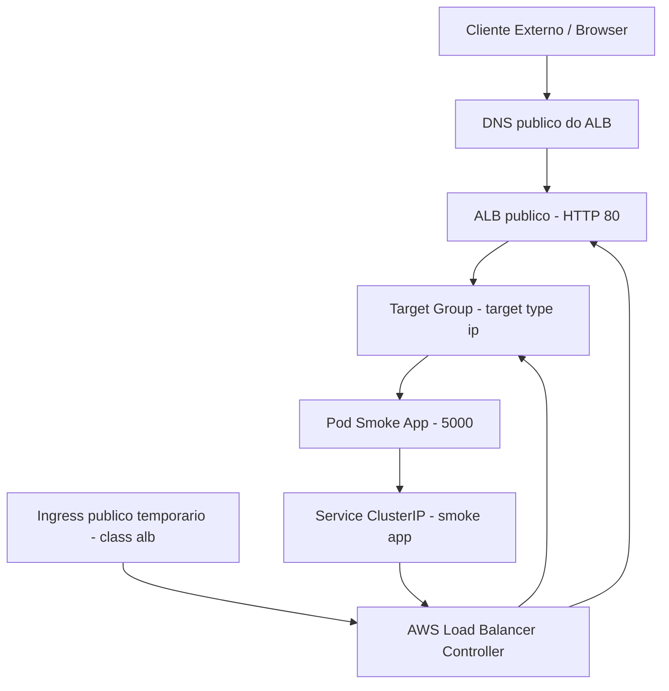
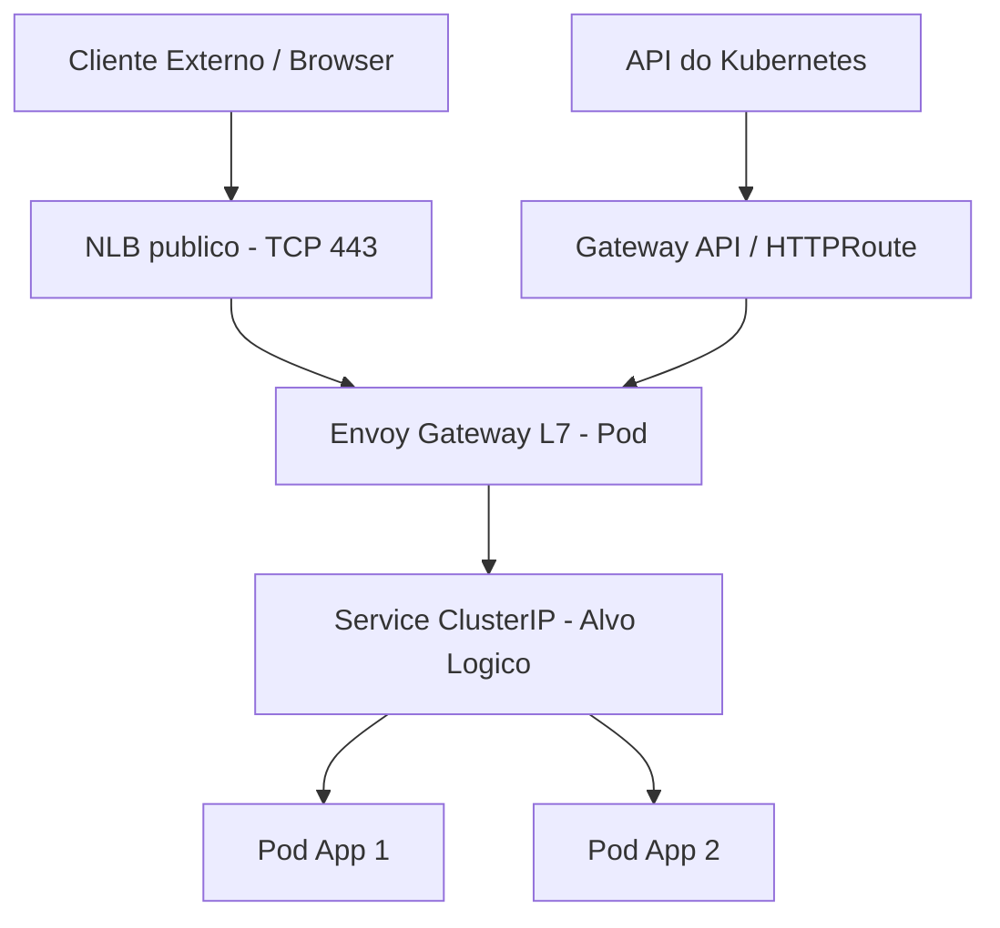

# Arquitetura da PoC EKS

## Estado atual: ALB publico temporario



Fluxo de trafego atual:

```text
Browser
-> DNS do ALB
-> ALB publico
-> Target Group
-> Pod da smoke app
```

O `Ingress` nao recebe trafego diretamente. Ele declara a regra, o AWS Load Balancer Controller reconcilia essa regra e cria/configura o ALB, listener, rule e target group.

## Evolucao alvo: NLB + Envoy Gateway



Fluxo alvo:

```text
Browser
-> NLB publico
-> Envoy Gateway
-> HTTPRoute
-> Service ClusterIP
-> Pods da app
```
