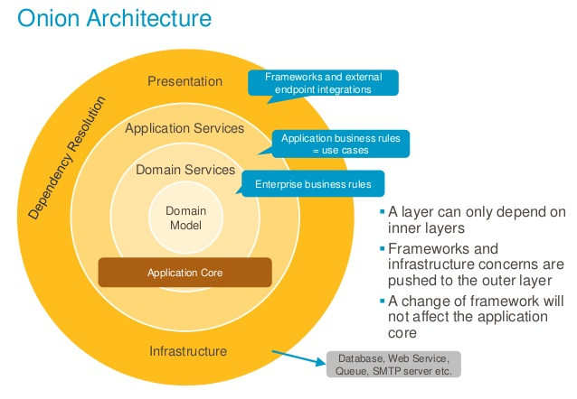
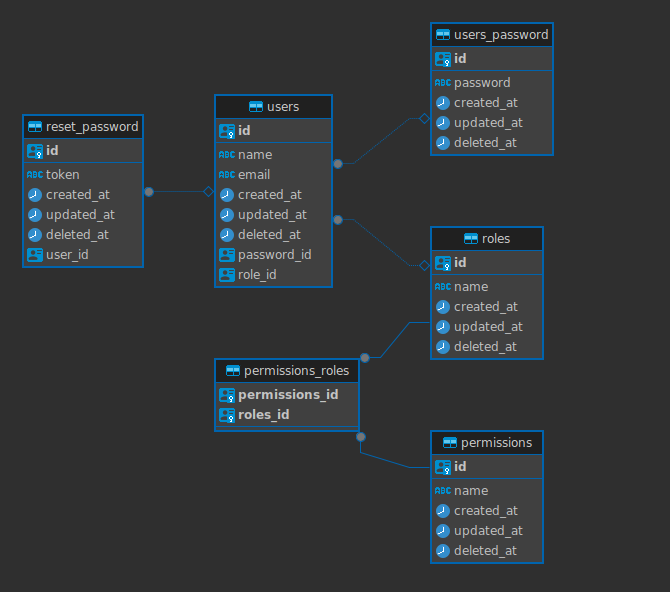

# Nestjs boilerplate Microservice API

[![node version][node-image]][node-url]

[node-image]: https://img.shields.io/badge/node.js-%3E=_22.0.0-green.svg?style=flat-square
[node-url]: http://nodejs.org/download/

In this microservice I used the best architecture concepts: Onion Architecture, DDD and Ports and Adapters.

| Statements                                                                               | Branches                                                                             | Functions                                                                              | Lines                                                                          |
| ---------------------------------------------------------------------------------------- | ------------------------------------------------------------------------------------ | -------------------------------------------------------------------------------------- | ------------------------------------------------------------------------------ |
|  |  |  |  |

### Building and Running the application

- install node version
  ```bash
  $ nvm install
  ```
  ```bash
  $ nvm use
  ```
- install dependencies
  ```
  $ yarn
  ```
- infra
  ```
   $ yarn infra
  ```
- running

  - dev
    ```
    $ yarn start:dev
    ```
  - debug
    ```
    $ start:debug
    ```
  - production
    ```
    $ yarn start
    ```

- build

  ```
  $ yarn build
  ```

---

# Login

```
curl -X 'POST' \
'http://localhost:4000/api/v1/login' \
-H 'accept: application/json' \
-H 'Content-Type: application/json' \
-d '{
  "email": "admin@admin.com",
  "password": "admin"
}'
```

### CRUD Scaffolding

Creating a CRUD in Postgres and Mongo in seconds.

- run
  ```
  $ yarn scaffold
  ```
- Choose database for CRUD.
- `(x) POSTGRES:CRUD`
- `( ) MONGO:CRUD`
- `( ) LIB`
- `( ) INFRA`
- `( ) MODULE`
- `( ) CORE`
- type module name (use the singular name)
- After generating the CRUD, follow the instructions on the generated link.
- Then

    

### Documentation(Swagger)

## docs/README.md

#### CRUD features

- List
  - mongo
    - search
    - pagination
    - sort
    - entity validation
  - postgres
    - search
    - pagination
    - sort
    - entity validation
- Delete
  - mongo
    - Logical deletion
    - entity validation
  - postgres
    - Logical deletion
    - entity validation
- Update
  - mongo
    - Update Partial entity
    - entity validation
  - postgres
    - Update Partial entity
    - entity validation
- Create
  - mongo
    - entity validation
    - Not allow creating duplicates
  - postgres
    - entity validation

### Postgres migrations

- create
  ```
  $ yarn migration-postgres:create
  ```
- run

  ```
  $ yarn migration-postgres:run
  ```

### Mongo migrations

- create
  ```
  $ yarn migration-mongo:create
  ```
- run

  ```
  $ yarn migration-mongo:run
  ```

### Test

- run
  ```
  $ yarn test
  ```
- coverage
  ```
  $ yarn test:cov
  ```

### Lint

- lint
  ```
  $ yarn lint
  ```
- prettier
  ```
  $ yarn prettier
  ```

### snippets

```
usecase
```

```
apitest
```

```
docs
```

### Architecture diagram

## 

[Architecture documentation](https://jeffreypalermo.com/2008/07/the-onion-architecture-part-1/)

### User diagram



### Microservice architecture.

- I18n
- Circuit Breaker
- Process Management and High Availability.
- Docker
- Observability
  - tracing
  - logs
  - metrics
  - alerts
- Lint-staged + Husky
- Commitlint
- Secrets Service
- HTTP Service
- Logger Service
- Authentication
  - Login
  - Logout
  - Forgot Password
  - Refresh Token
- Authorization
  - Role-based access
  - Endpoint Permissions
- Error Handler
- Libs Structure
- Dependency Inversion Pattern
- Usecase Pattern
- Interface Adapter Pattern
- Generic Repository Pattern
  - Mongo Repository (mongoose)
  - Postgres Repository (TypeORM)
- Swagger Documentation
- Cache Service
  - Redis
  - NodeCache
- Database
  - mongo
    - Migrations
  - postgres
    - Migrations
- Tests
  - unit
  - 100% coverage
  - Testcontainers

-- App Skeleton

```
├── CHANGELOG.md
├── Dockerfile
├── OnionGraph.jpg
├── README.md
├── TRACING.md
├── commitlint.config.js
├── diagram.png
├── docker-compose-infra.yml
├── docker-compose.yml
├── eslint.config.mjs
├── jest-coverage.config.ts
├── jest.config.ts
├── nest-cli.json
├── package-lock.json
├── package.json
├── scripts
│   └── npm-audit.sh
├── src
│   ├── app.module.ts
│   ├── core
│   │   ├── cat
│   │   │   ├── entity
│   │   │   │   └── cat.ts
│   │   │   ├── repository
│   │   │   │   └── cat.ts
│   │   │   └── use-cases
│   │   │       ├── __tests__
│   │   │       │   ├── cat-create.spec.ts
│   │   │       │   ├── cat-delete.spec.ts
│   │   │       │   ├── cat-get-by-id.spec.ts
│   │   │       │   ├── cat-list.spec.ts
│   │   │       │   └── cat-update.spec.ts
│   │   │       ├── cat-create.ts
│   │   │       ├── cat-delete.ts
│   │   │       ├── cat-get-by-id.ts
│   │   │       ├── cat-list.ts
│   │   │       └── cat-update.ts
│   │   ├── permission
│   │   │   ├── entity
│   │   │   │   └── permission.ts
│   │   │   ├── repository
│   │   │   │   └── permission.ts
│   │   │   └── use-cases
│   │   │       ├── __tests__
│   │   │       │   ├── permission-create.spec.ts
│   │   │       │   ├── permission-delete.spec.ts
│   │   │       │   ├── permission-get-by-id.spec.ts
│   │   │       │   ├── permission-list.spec.ts
│   │   │       │   └── permission-update.spec.ts
│   │   │       ├── permission-create.ts
│   │   │       ├── permission-delete.ts
│   │   │       ├── permission-get-by-id.ts
│   │   │       ├── permission-list.ts
│   │   │       └── permission-update.ts
│   │   ├── reset-password
│   │   │   ├── entity
│   │   │   │   └── reset-password.ts
│   │   │   ├── repository
│   │   │   │   └── reset-password.ts
│   │   │   └── use-cases
│   │   │       ├── __tests__
│   │   │       │   ├── reset-password-confirm.spec.ts
│   │   │       │   └── reset-password-send-email.spec.ts
│   │   │       ├── reset-password-confirm.ts
│   │   │       └── reset-password-send-email.ts
│   │   ├── role
│   │   │   ├── entity
│   │   │   │   └── role.ts
│   │   │   ├── repository
│   │   │   │   └── role.ts
│   │   │   └── use-cases
│   │   │       ├── __tests__
│   │   │       │   ├── role-add-permission.spec.ts
│   │   │       │   ├── role-create.spec.ts
│   │   │       │   ├── role-delete-permission.spec.ts
│   │   │       │   ├── role-delete.spec.ts
│   │   │       │   ├── role-get-by-id.spec.ts
│   │   │       │   ├── role-list.spec.ts
│   │   │       │   └── role-update.spec.ts
│   │   │       ├── role-add-permission.ts
│   │   │       ├── role-create.ts
│   │   │       ├── role-delete-permission.ts
│   │   │       ├── role-delete.ts
│   │   │       ├── role-get-by-id.ts
│   │   │       ├── role-list.ts
│   │   │       └── role-update.ts
│   │   └── user
│   │       ├── entity
│   │       │   ├── user-password.ts
│   │       │   └── user.ts
│   │       ├── repository
│   │       │   └── user.ts
│   │       └── use-cases
│   │           ├── __tests__
│   │           │   ├── user-change-password.spec.ts
│   │           │   ├── user-create.spec.ts
│   │           │   ├── user-delete.spec.ts
│   │           │   ├── user-get-by-id.spec.ts
│   │           │   ├── user-list.spec.ts
│   │           │   ├── user-login.spec.ts
│   │           │   ├── user-logout.spec.ts
│   │           │   ├── user-refresh-token.spec.ts
│   │           │   └── user-update.spec.ts
│   │           ├── user-change-password.ts
│   │           ├── user-create.ts
│   │           ├── user-delete.ts
│   │           ├── user-get-by-id.ts
│   │           ├── user-list.ts
│   │           ├── user-login.ts
│   │           ├── user-logout.ts
│   │           ├── user-refresh-token.ts
│   │           └── user-update.ts
│   ├── infra
│   │   ├── cache
│   │   │   ├── adapter.ts
│   │   │   ├── index.ts
│   │   │   ├── memory
│   │   │   │   ├── index.ts
│   │   │   │   ├── module.ts
│   │   │   │   ├── service.ts
│   │   │   │   └── types.ts
│   │   │   ├── redis
│   │   │   │   ├── index.ts
│   │   │   │   ├── module.ts
│   │   │   │   ├── service.ts
│   │   │   │   └── types.ts
│   │   │   └── types.ts
│   │   ├── database
│   │   │   ├── adapter.ts
│   │   │   ├── enum.ts
│   │   │   ├── index.ts
│   │   │   ├── mongo
│   │   │   │   ├── config.ts
│   │   │   │   ├── index.ts
│   │   │   │   ├── migrations
│   │   │   │   │   └── 1709943706267_createCatsCollection.ts
│   │   │   │   ├── module.ts
│   │   │   │   ├── schemas
│   │   │   │   │   └── cat.ts
│   │   │   │   └── service.ts
│   │   │   ├── postgres
│   │   │   │   ├── config.ts
│   │   │   │   ├── index.ts
│   │   │   │   ├── migrations
│   │   │   │   │   ├── 1727653462661-createPermissionTable.ts
│   │   │   │   │   ├── 1727653565690-createRoleTable.ts
│   │   │   │   │   ├── 1727653630438-createUserPasswordTable.ts
│   │   │   │   │   ├── 1727653714156-createUserTable.ts
│   │   │   │   │   ├── 1727653808424-createResetPassword.ts
│   │   │   │   │   ├── 1727653954337-createPermissionRoleTable.ts
│   │   │   │   │   ├── 1727654008041-createUserRoleTable.ts
│   │   │   │   │   ├── 1727654289658-createTableRelationship.ts
│   │   │   │   │   ├── 1727654555722-insertPermissions.ts
│   │   │   │   │   ├── 1727654843890-insertRoles.ts
│   │   │   │   │   ├── 1727655177319-insertUser.ts
│   │   │   │   │   └── 1727657387427-addUnaccentExtension.ts
│   │   │   │   ├── module.ts
│   │   │   │   ├── schemas
│   │   │   │   │   ├── permission.ts
│   │   │   │   │   ├── reset-password.ts
│   │   │   │   │   ├── role.ts
│   │   │   │   │   ├── user-password.ts
│   │   │   │   │   └── user.ts
│   │   │   │   └── service.ts
│   │   │   └── types.ts
│   │   ├── email
│   │   │   ├── adapter.ts
│   │   │   ├── index.ts
│   │   │   ├── module.ts
│   │   │   ├── service.ts
│   │   │   └── templates
│   │   │       ├── reque-reset-password.handlebars
│   │   │       ├── reset-password.handlebars
│   │   │       └── welcome.handlebars
│   │   ├── http
│   │   │   ├── adapter.ts
│   │   │   ├── index.ts
│   │   │   ├── module.ts
│   │   │   └── service.ts
│   │   ├── logger
│   │   │   ├── adapter.ts
│   │   │   ├── index.ts
│   │   │   ├── module.ts
│   │   │   ├── service.ts
│   │   │   └── types.ts
│   │   ├── module.ts
│   │   ├── repository
│   │   │   ├── adapter.ts
│   │   │   ├── index.ts
│   │   │   ├── mongo
│   │   │   │   └── repository.ts
│   │   │   ├── postgres
│   │   │   │   └── repository.ts
│   │   │   ├── types.ts
│   │   │   └── util.ts
│   │   └── secrets
│   │       ├── adapter.ts
│   │       ├── index.ts
│   │       ├── module.ts
│   │       ├── service.ts
│   │       └── types.ts
│   ├── libs
│   │   ├── event
│   │   │   ├── adapter.ts
│   │   │   ├── index.ts
│   │   │   ├── module.ts
│   │   │   ├── service.ts
│   │   │   └── types.ts
│   │   ├── i18n
│   │   │   ├── adapter.ts
│   │   │   ├── index.ts
│   │   │   ├── languages
│   │   │   │   ├── en
│   │   │   │   │   └── info.json
│   │   │   │   └── pt
│   │   │   │       └── info.json
│   │   │   ├── module.ts
│   │   │   ├── service.ts
│   │   │   └── types.ts
│   │   ├── module.ts
│   │   └── token
│   │       ├── adapter.ts
│   │       ├── index.ts
│   │       ├── module.ts
│   │       └── service.ts
│   ├── main.ts
│   ├── modules
│   │   ├── cat
│   │   │   ├── adapter.ts
│   │   │   ├── controller.ts
│   │   │   ├── module.ts
│   │   │   ├── repository.ts
│   │   │   └── swagger.ts
│   │   ├── health
│   │   │   ├── __tests__
│   │   │   │   └── controller.spec.ts
│   │   │   ├── controller.ts
│   │   │   └── module.ts
│   │   ├── login
│   │   │   ├── adapter.ts
│   │   │   ├── controller.ts
│   │   │   ├── module.ts
│   │   │   └── swagger.ts
│   │   ├── logout
│   │   │   ├── adapter.ts
│   │   │   ├── controller.ts
│   │   │   ├── module.ts
│   │   │   └── swagger.ts
│   │   ├── permission
│   │   │   ├── adapter.ts
│   │   │   ├── controller.ts
│   │   │   ├── module.ts
│   │   │   ├── repository.ts
│   │   │   └── swagger.ts
│   │   ├── reset-password
│   │   │   ├── adapter.ts
│   │   │   ├── controller.ts
│   │   │   ├── module.ts
│   │   │   ├── repository.ts
│   │   │   └── swagger.ts
│   │   ├── role
│   │   │   ├── adapter.ts
│   │   │   ├── controller.ts
│   │   │   ├── module.ts
│   │   │   ├── repository.ts
│   │   │   └── swagger.ts
│   │   └── user
│   │       ├── adapter.ts
│   │       ├── controller.ts
│   │       ├── module.ts
│   │       ├── repository.ts
│   │       └── swagger.ts
│   ├── observables
│   │   ├── filters
│   │   │   ├── http-exception.filter.ts
│   │   │   └── index.ts
│   │   ├── guards
│   │   │   ├── auth.guard.ts
│   │   │   └── index.ts
│   │   ├── interceptors
│   │   │   ├── http-exception.interceptor.ts
│   │   │   ├── http-logger.interceptor.ts
│   │   │   ├── index.ts
│   │   │   ├── metrics.interceptor.ts
│   │   │   ├── request-timeout.interceptor.ts
│   │   │   └── tracing.interceptor.ts
│   │   └── middlewares
│   │       ├── authetication.middleware.ts
│   │       └── index.ts
│   └── utils
│       ├── axios.ts
│       ├── collection.ts
│       ├── crypto.ts
│       ├── date.ts
│       ├── decorators
│       │   ├── database
│       │   │   ├── mongo
│       │   │   │   ├── convert-mongoose-filter.decorator.ts
│       │   │   │   └── validate-mongoose-filter.decorator.ts
│       │   │   ├── postgres
│       │   │   │   └── validate-typeorm-filter.decorator.ts
│       │   │   ├── utils.ts
│       │   │   └── validate-database-sort-allowed.decorator.ts
│       │   ├── index.ts
│       │   ├── request-timeout.decorator.ts
│       │   ├── role.decorator.ts
│       │   ├── types.ts
│       │   └── validate-schema.decorator.ts
│       ├── docs
│       │   ├── data
│       │   │   ├── cat
│       │   │   │   ├── request.ts
│       │   │   │   └── response.ts
│       │   │   ├── permission
│       │   │   │   ├── request.ts
│       │   │   │   └── response.ts
│       │   │   ├── role
│       │   │   │   ├── request.ts
│       │   │   │   └── response.ts
│       │   │   └── user
│       │   │       ├── request.ts
│       │   │       └── response.ts
│       │   └── swagger.ts
│       ├── entity.ts
│       ├── excel.ts
│       ├── exception.ts
│       ├── http-status.ts
│       ├── mongoose.ts
│       ├── pagination.ts
│       ├── request.ts
│       ├── search.ts
│       ├── sort.ts
│       ├── tests.ts
│       ├── text.ts
│       ├── tracing.ts
│       ├── usecase.ts
│       ├── uuid.ts
│       └── zod.ts
├── test
│   └── initialization.ts
├── tsconfig.build.json
├── tsconfig.json
└── yarn.lock
```

---

The following is a list of all the people that have contributed Nestjs monorepo boilerplate. Thanks for your contributions!

[](https://github.com/mikemajesty)

## License

It is available under the MIT license.
[License](https://opensource.org/licenses/mit-license.php)
