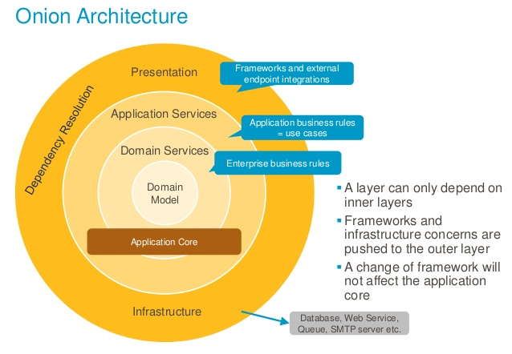
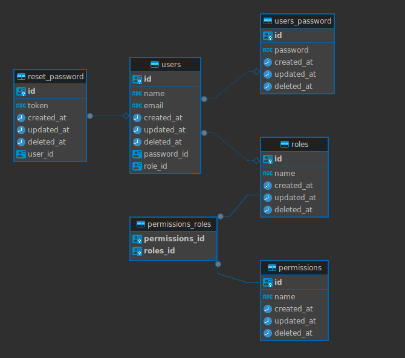

<div align="center">
  <h1>🚀 NestJS Microservice Boilerplate API</h1>
  <p><strong>Enterprise-grade, production-ready NestJS boilerplate with modern architecture patterns</strong></p>

[![Node.js Version][node-image]][node-url]
[](https://www.typescriptlang.org/)
[](https://nestjs.com/)
[](https://opensource.org/licenses/MIT)

[node-image]: https://img.shields.io/badge/node.js-%3E=_22.0.0-green.svg?style=flat-square
[node-url]: http://nodejs.org/download/

  <h3>Code Coverage</h3>

| Statements                                                                               | Branches                                                                             | Functions                                                                              | Lines                                                                          |
| ---------------------------------------------------------------------------------------- | ------------------------------------------------------------------------------------ | -------------------------------------------------------------------------------------- | ------------------------------------------------------------------------------ |
|  |  |  |  |

</div>

---

## Table of Contents

- [Architecture Overview](#architecture-overview)
- [Architecture Comparison](#architecture-comparison)
- [Layer Communication Rules](#layer-communication-rules)
- [Project Structure](#project-structure)
- [Quick Start](#quick-start)
- [User Flow](#user-flow)
- [Documentation Guides](#documentation-guides)
- [Key Features](#key-features)
- [Tech Stack](#tech-stack)
- [Contributing](#contributing)
- [License](#license)

---

## Architecture Overview

This project implements a **pragmatic architecture** that combines the best ideas from Clean Architecture, Domain-Driven Design (DDD), and Hexagonal Architecture. Rather than strictly following one pattern, it takes a practical approach: **powerful enough for enterprise applications, yet simple enough for any developer to understand and maintain**.

### The Core Philosophy

The architecture is built around one fundamental principle: **protect your business logic**. Your domain rules should never depend on frameworks, databases, or external services. If you decide to switch from PostgreSQL to MongoDB, or from Redis to Memcached, your core business logic remains untouched.



---

## Architecture Comparison

### Clean Architecture

Clean Architecture organizes code into concentric circles where dependencies point inward. The innermost circle contains business rules, and outer circles contain implementation details.

**How we implement it:**

- **Entities** live in `src/core/*/entity` — pure business objects
- **Use Cases** live in `src/core/*/use-cases` — application-specific business rules
- **Interfaces** live in `src/core/*/repository` — contracts for external dependencies
- **Frameworks** live in `src/modules` and `src/infra` — NestJS controllers and database implementations
  **What we simplified:**
- No explicit Interactors or Presenters
- No input/output boundary classes

### Domain-Driven Design (DDD)

DDD focuses on modeling your business domain. It introduces concepts like Entities, Value Objects, Aggregates, and Repositories.

**How we implement it:**

- **Entities**: Objects with identity that persist over time (`UserEntity`, `RoleEntity`)
- **Repository Pattern**: Abstract interfaces defining data access contracts
- **Use Cases**: Encapsulate business operations (similar to Application Services in DDD)
- **Bounded Contexts**: Each module represents a bounded context

**What we simplified:**

- No Value Objects as separate classes
- Unified service layer (no Domain/Application Service split)

#### Service Layer Comparison: DDD vs. This Architecture

In traditional DDD, there are two types of services:

- **Domain Service:** Encapsulates domain logic that does not naturally fit within an Entity or Value Object.
- **Application Service:** Coordinates use cases, orchestrating entities, repositories, and domain services to fulfill business processes.

**In this architecture, both responsibilities are unified into a single component: the `UseCase`.**

- The `UseCase` acts as the application service, orchestrating business operations and dependencies.
- Domain logic that would be placed in a domain service is either implemented within entities or directly in the use case, depending on complexity.

This simplification reduces boilerplate and cognitive overhead, while still maintaining a clear separation between business logic and infrastructure. The result is a leaner, more maintainable service layer without sacrificing the core benefits of DDD.

### Hexagonal Architecture (Ports and Adapters)

Hexagonal Architecture separates the application from external concerns through Ports (interfaces) and Adapters (implementations).

**How we implement it:**

```
┌──────────────────────────────────────────────────────────────┐
│                        ADAPTERS                              │
│  ┌─────────────┐  ┌─────────────┐  ┌─────────────────────┐   │
│  │ Controllers │  │ Repositories│  │ External Services   │   │
│  │ (modules/)  │  │ (modules/)  │  │ (infra/)            │   │
│  └──────┬──────┘  └──────┬──────┘  └──────────┬──────────┘   │
│         │                │                    │              │
│         ▼                ▼                    ▼              │
│  ┌─────────────────────────────────────────────────────────┐ │
│  │                      PORTS                              │ │
│  │            (core/*/repository interfaces)               │ │
│  └─────────────────────────┬───────────────────────────────┘ │
│                            │                                 │
│                            ▼                                 │
│  ┌─────────────────────────────────────────────────────────┐ │
│  │                       CORE                              │ │
│  │           Entities + Use Cases + Interfaces             │ │
│  │                     (src/core/)                         │ │
│  └─────────────────────────────────────────────────────────┘ │
└──────────────────────────────────────────────────────────────┘
```

**Ports (Interfaces):**

- `ICatRepository` — defines what operations are available
- `IHttpAdapter` — defines HTTP client contract
- `ICacheAdapter` — defines caching contract

**Adapters (Implementations):**

- `CatRepository` in `modules/` — implements `ICatRepository` with TypeORM/Mongoose
- `HttpService` in `infra/` — implements `IHttpAdapter` with Axios
- `RedisService` in `infra/` — implements `ICacheAdapter` with Redis

---

## Design Decisions

> ⚠️ **Important Notes About This Architecture**
>
> This section explains some deliberate choices that differ from traditional implementations. Understanding these decisions will help you work with the codebase effectively.

### Why We Call Interfaces "Adapters"

You may notice that some interfaces in this project use the word "Adapter" (e.g., `IHttpAdapter`, `ICacheAdapter`). In traditional Hexagonal Architecture:

- **Port**: An interface that defines a contract (what operations are available)
- **Adapter**: A concrete implementation that fulfills that contract (how it's done)

**The academic distinction:**

```
┌──────────────────────────────────────────────────────────────┐
│                  HEXAGONAL (Traditional)                     │
├──────────────────────────────────────────────────────────────┤
│                                                              │
│   Port (Interface)              Adapter (Implementation)     │
│   ─────────────────             ────────────────────────     │
│   IUserRepository        →      PostgresUserRepository       │
│   IEmailService          →      SendGridEmailService         │
│   ICacheService          →      RedisCacheService            │
│                                                              │
└──────────────────────────────────────────────────────────────┘
```

**Our simplified approach:**

We use "Adapter" in interface names because, conceptually, **both are abstractions**. The fundamental principle is the same: decouple your core business logic from implementation details. Whether you call the interface a "Port" or "Adapter" doesn't change how the pattern works.

```typescript
// Traditional naming
interface IUserRepository {} // Port
class PostgresUserRepository {} // Adapter

// Our naming (simplified)
interface IHttpAdapter {} // Still an abstraction (contract)
class HttpService {} // Still an implementation
```

**Why this simplification?**

1. **Reduced cognitive load** — One less concept to explain to new developers
2. **Practical focus** — The behavior is identical regardless of naming
3. **Consistency** — All abstractions follow the same `I*Adapter` pattern

The key takeaway: **if it's an interface, it's a contract. If it's a class implementing that interface, it's the implementation.** The names are just labels.

---

### Why We Use Abstract Classes Instead of Interfaces

You may notice that repository contracts use `abstract class` instead of TypeScript `interface`:

```typescript
// What we use
export abstract class ICatRepository extends IRepository<CatEntity> {
  abstract findByBreed(breed: string): Promise<CatEntity[]>
}

// Instead of
export interface ICatRepository extends IRepository<CatEntity> {
  findByBreed(breed: string): Promise<CatEntity[]>
}
```

**Why?** This is a **NestJS/Node.js limitation**.

TypeScript interfaces are erased at runtime — they don't exist in the compiled JavaScript. NestJS dependency injection relies on runtime tokens to resolve providers. If we used interfaces, we would need to pass a string token:

```typescript
// ❌ With interface — requires string token
@Module({
  providers: [
    {
      provide: 'ICatRepository',  // String token (error-prone, no type safety)
      useClass: CatRepository,
    },
  ],
})

// ✅ With abstract class — class itself is the token
@Module({
  providers: [
    {
      provide: ICatRepository,    // Class reference (type-safe, refactorable)
      useClass: CatRepository,
    },
  ],
})
```

**Benefits of abstract classes:**

1. **Type safety** — No magic strings, refactoring tools work correctly
2. **Runtime existence** — The class exists in compiled JavaScript
3. **Same behavior** — Acts as a contract just like an interface
4. **Better DX** — IDE autocomplete and "Go to Definition" work properly

**The trade-off:** Abstract classes can have implementation details (which interfaces cannot). We simply don't use that feature — our abstract classes are pure contracts.

---

### Why the "Middlewares" Folder Contains More Than Middlewares

Yes, we know. The `src/middlewares/` folder contains:

- Middlewares (authentication)
- Guards (authorization)
- Interceptors (logging, tracing)
- Filters (exception handling)

**Why didn't we split them?**

Honestly? We couldn't find a better name. 🤷

We tried:

- `http-pipeline/` — too generic
- `request-handlers/` — not quite right
- `cross-cutting/` — sounds like a buzzword bingo winner
- `stuff-that-runs-before-and-after-your-code/` — accurate but... no

So we stuck with `middlewares/` because:

1. They all operate in the HTTP request/response lifecycle
2. They're all "things that wrap your controller logic"
3. Everyone knows where to find them

**If you have a better name, PRs are welcome!** Until then, just accept that `middlewares/` is a "creative interpretation" of the term. 😄

---

### Why Validations Live Inside Use Cases

This is a fundamental difference from many Clean Architecture implementations.

**The traditional approach (Clean Architecture):**

```
Controller → Validates Input → Use Case → Business Logic
```

In traditional Clean Architecture, input validation happens in the Controller or a dedicated Validation layer before reaching the Use Case. The Use Case assumes it receives valid data.

**Our approach:**

```
Controller → Use Case (Validates + Business Logic)
```

We validate inputs **inside** the Use Case using Zod schemas.

**Why we made this choice:**

1. **Testability**

   When you test a Use Case, you should test the complete behavior — including validation. It's unacceptable to have a Use Case that passes tests but fails in production because validation was bypassed.

   ```typescript
   // Our tests validate the complete use case behavior
   it('should throw validation error for invalid email', async () => {
     const input = { email: 'invalid-email', name: 'John' }
     await expect(useCase.execute(input)).rejects.toThrow(ValidationException)
   })
   ```

2. **Use Case Integrity**

   A Use Case is a complete unit of business logic. If `CreateUserUseCase` requires a valid email, that validation IS part of the use case — not something external to it.

3. **Self-Documenting Code**

   Looking at a Use Case, you immediately see what inputs it expects and how they're validated. No need to hunt through multiple layers.

4. **Reduced Duplication**

   If multiple controllers call the same Use Case, validations are automatically applied. No risk of one controller forgetting to validate.

**Comparison with other approaches:**

| Approach              | Validation Location             | Pros                                 | Cons                                       |
| --------------------- | ------------------------------- | ------------------------------------ | ------------------------------------------ |
| **Traditional Clean** | Controller/Validator layer      | Thin use cases                       | Validation can be bypassed, harder to test |
| **DDD**               | Domain entities (Value Objects) | Rich domain model                    | Complex, verbose                           |
| **Our Approach**      | Inside Use Case                 | Complete testability, self-contained | See trade-offs below                       |

**The trade-off:**

If you need to consume a Use Case from multiple entry points with **different validation rules**, the Use Case validations might be too restrictive.

**Solution:** For those cases, move specific validations to the Application layer (Controller/Adapter). The Use Case can have minimal validations (or none), and each consumer applies its own rules:

```typescript
// Controller A - Web API (strict validation)
@Post()
async create(@Body() input: CreateUserInput): Promise<UserCreateOutput> {
  // Validate for web context
  const validated = WebUserSchema.parse(input);
  return this.useCase.execute(validated);
}

// Controller B - Internal service (different validation)
async createFromInternal(input: InternalUserInput): Promise<UserCreateOutput> {
  // Validate for internal context
  const validated = InternalUserSchema.parse(input);
  return this.useCase.execute(validated);
}
```

**Our recommendation:** Start with validations inside Use Cases. Only move them out when you have a concrete need for different validation rules per consumer.

---

## What to Avoid in Core

The `core/` folder is sacred — it contains your business logic and must remain **pure and independent**. Here are the key rules to follow:

### Entities: Avoid Anemic Models

An **anemic entity** is just a data container with no behavior — essentially a DTO. This is an anti-pattern because business logic ends up scattered across use cases and services.

| ❌ Avoid                    | ✅ Prefer                                                 |
| --------------------------- | --------------------------------------------------------- |
| Entity with only properties | Entity with properties **and** behavior                   |
| Business logic in Use Cases | Business logic **in the Entity** when it relates to state |
| Calculations outside entity | Calculations as entity methods                            |

**Ask yourself:** "Does this logic relate to the entity's state?" If yes, it belongs in the entity.

📖 **See detailed examples:** [Entity Guide](guides/core/entity.md) — includes Rich Entity vs Anemic Entity comparison

---

### Entities: Must Extend BaseEntity

Every Entity **must extend** the `BaseEntity` class. This is mandatory in this project.

| ❌ Avoid                     | ✅ Prefer                                                    |
| ---------------------------- | ------------------------------------------------------------ |
| `class UserEntity { }`       | `class UserEntity extends BaseEntity<UserEntity>() { }`      |
| `export class CatEntity { }` | `export class CatEntity extends BaseEntity<CatEntity>() { }` |

```typescript
// ❌ WRONG - Not extending BaseEntity
export class CatEntity {
  id!: string
  name!: string
  breed!: string
  age!: number
  createdAt?: Date
  updatedAt?: Date
  deletedAt?: Date

  constructor(entity: Cat) {
    Object.assign(this, entity)
  }
}

// ✅ CORRECT - Extends BaseEntity
import { BaseEntity } from '@/utils/entity'

export class CatEntity extends BaseEntity<CatEntity>() {
  name!: Cat['name']
  breed!: Cat['breed']
  age!: Cat['age']

  constructor(entity: Cat) {
    super(CatEntitySchema)
    this.validate(entity)
    this.ensureID()
  }
}
```

**What BaseEntity provides:**

1. **Common properties** — `id`, `createdAt`, `updatedAt`, `deletedAt` are inherited
2. **Validation** — `validate(entity)` method validates input against Zod schema
3. **ID generation** — `ensureID()` generates UUID if not provided
4. **Status methods** — `isActive()`, `isDeleted()`, `activate()`, `deactivate()`
5. **Serialization** — `toObject()` returns plain object, `clone()` creates a copy
6. **Type safety** — `nameOf()` provides type-safe property names

**Constructor pattern:**

Every entity constructor must follow this pattern:

```typescript
constructor(entity: Cat) {
  super(CatEntitySchema)  // 1. Pass Zod schema to parent
  this.validate(entity)   // 2. Validate and assign properties
  this.ensureID()         // 3. Generate ID if not provided
}
```

📖 **See detailed examples:** [Entity Guide](guides/core/entity.md) — includes full entity implementation

---

### Use Cases: Never Know Implementations

A Use Case must **never, absolutely never** know about concrete implementations. It should only work with **abstractions (interfaces)**.

This is the most important rule: **the Use Case receives abstractions, never implementations**.

- ✅ Entities (`core/*/entity`)
- ✅ Repository interfaces (`core/*/repository`)
- ✅ Adapter interfaces (`IHttpAdapter`, `ICacheAdapter`, etc.)
- ✅ Utils and decorators (`utils/`)
- ✅ Types and interfaces

| ❌ Avoid                                                   | ✅ Prefer                                                    |
| ---------------------------------------------------------- | ------------------------------------------------------------ |
| `import { Controller } from '@nestjs/common'`              | No framework imports                                         |
| `import { UserRepository } from 'modules/user/repository'` | `import { IUserRepository } from 'core/user/repository'`     |
| `import { HttpService } from 'infra/http'`                 | `import { IHttpAdapter } from 'infra/http'` (interface only) |
| Direct database calls (TypeORM, Mongoose)                  | Repository interface methods                                 |
| `new RedisService()`                                       | Receive `ICacheAdapter` via constructor                      |

**The golden rule:**

```typescript
// ❌ WRONG - Use Case knows the implementation
import { HttpService } from '@/infra/http/service'

class MyUseCase {
  constructor(private http: HttpService) {} // Concrete class!
}

// ✅ CORRECT - Use Case only knows the abstraction
import { IHttpAdapter } from '@/infra/http/adapter'

class MyUseCase implements IUsecase {
  constructor(private http: IHttpAdapter) {} // Interface!
}
```

**Why?** The Use Case should work identically whether:

- Called from a REST controller, GraphQL resolver, CLI, or message queue
- Using Redis or Memcached for cache
- Using Axios or Fetch for HTTP
- Running in tests with mocks

---

### Use Cases: Must Implement IUsecase

Every Use Case **must implement** the `IUsecase` interface. This is mandatory in this project.

| ❌ Avoid                             | ✅ Prefer                                                |
| ------------------------------------ | -------------------------------------------------------- |
| `class MyUseCase { }`                | `class MyUseCase implements IUsecase { }`                |
| `export class CreateUserUseCase { }` | `export class CreateUserUseCase implements IUsecase { }` |

````typescript
// ❌ WRONG - Not implementing IUsecase
export class CatCreateUsecase {
  constructor(private readonly catRepository: ICatRepository) {}

  async execute(input: CatCreateInput): Promise<CatCreateOutput> {
    // ...
  }
}

// ✅ CORRECT - Implements IUsecase
import { IUsecase } from '@/utils/usecase';

export class CatCreateUsecase implements IUsecase {
  constructor(private readonly catRepository: ICatRepository) {}

  }
}
**What we simplified:**
    - No explicit inbound/outbound port distinction
    - Unified adapter naming for interfaces and implementations

1. **Contract enforcement** — Ensures all Use Cases have the same structure
2. **Dependency injection** — NestJS can properly inject and resolve Use Cases
3. **Type safety** — TypeScript validates that `execute()` method exists
4. **Consistency** — Every Use Case follows the same pattern across the project

📖 **See detailed patterns:** [Use Case Guide](guides/core/usecase.md) — includes architecture diagrams and testing patterns

---

### Repository Interfaces: Avoid Duplicating Generic Methods

The repository interface should **only declare methods that don't exist** in the generic `IRepository<T>`. The generic repository already provides 20+ methods:

| ❌ Avoid | ✅ Prefer |
|----------|-----------|
| Declaring `create()`, `findById()`, `update()` | Already inherited from `IRepository<T>` |
| Duplicating generic query methods | Only add **domain-specific** queries |

```typescript
// ❌ Wrong - These already exist in IRepository
export abstract class ICatRepository extends IRepository<CatEntity> {
  abstract create(entity: CatEntity): Promise<CatEntity>  // Already exists!
  abstract findById(id: string): Promise<CatEntity>      // Already exists!
}

// ✅ Correct - Only domain-specific methods
export abstract class ICatRepository extends IRepository<CatEntity> {
  abstract paginate(input: CatListInput): Promise<CatListOutput>
  abstract findByBreed(breed: string): Promise<CatEntity[]>
}
````

📖 **See full method list:** [Repository Guide](guides/core/repository.md) — includes `IRepository<T>` generic methods and examples

---

### Controllers: Avoid Business Logic

Controllers must **never contain business logic**. Their responsibility is limited to:

1. **Orchestration** — Receive request, call use case, return response
2. **Input standardization** — Transform and normalize inputs for the use case

| ❌ Avoid                   | ✅ Prefer                  |
| -------------------------- | -------------------------- |
| Calculations in controller | Move to Use Case or Entity |
| Conditional business rules | Move to Use Case           |
| Data manipulation          | Move to Use Case           |
| Multiple repository calls  | Move to Use Case           |

**When input standardization is OK:**

We standardize listing inputs (pagination, sorting, search) in the Controller before calling the Use Case:

```typescript
// ✅ OK - Standardizing pagination inputs (not business logic)
@Get()
@Version('1')
@Permission('cat:list')
async list(@Req() { query }: ApiRequest): Promise<CatListOutput> {
  const input: CatListInput = {
    sort: SortHttpSchema.parse(query.sort),
    search: SearchHttpSchema.parse(query.search),
    limit: Number(query.limit),
    page: Number(query.page)
  }

  return await this.listUsecase.execute(input)
}

// ❌ WRONG - Business logic in controller
@Post()
@Version('1')
@Permission('cat:create')
async create(@Req() { body }: ApiRequest): Promise<CatCreateOutput> {
  // DON'T DO THIS - business logic belongs in Use Case
  if (body.age > 10) {
    body.status = 'senior';
  }
  const discount = body.price * 0.1; // Business calculation!
  return await this.createUsecase.execute({ ...body, discount });
}
```

📖 **See detailed patterns:** [Controller Guide](guides/modules/controller.md) and [Adapter Guide](guides/modules/adapter.md) — includes examples and best practices

---

### Core: Avoid External Libraries

The `core/` folder must remain **pure and framework-agnostic**. Never import external libraries directly into entities or use cases.

| ❌ Avoid in Core                       | ✅ Prefer                                |
| -------------------------------------- | ---------------------------------------- |
| `import axios from 'axios'`            | Use `IHttpAdapter` interface             |
| `import { Repository } from 'typeorm'` | Use `IRepository<T>` interface           |
| `import moment from 'moment'`          | Use `utils/date` or native Date          |
| `import _ from 'lodash'`               | Use `utils/collection` or native methods |
| `import Redis from 'ioredis'`          | Use `ICacheAdapter` interface            |

**Why?**

If you import `axios` directly into a Use Case:

- You can't easily test it (need to mock axios globally)
- You can't swap to `fetch` or another HTTP client
- Your core business logic is coupled to a specific library

```typescript
// ❌ WRONG - External library in Use Case
import axios from 'axios'

export class GetExternalDataUseCase {
  async execute(): Promise<ExternalData> {
    const response = await axios.get('https://api.example.com/data')
    return response.data
  }
}

// ✅ CORRECT - Use abstraction
import { IHttpAdapter } from '@/infra/http/adapter'
import { IUsecase } from '@/utils/usecase'

export class GetExternalDataUseCase implements IUsecase {
  constructor(private readonly http: IHttpAdapter) {}

  async execute(): Promise<ExternalData> {
    const response = await this.http.get({ url: 'https://api.example.com/data' })
    return response.data
  }
}
```

**Allowed in Core:**

- ✅ Zod (validation is part of domain logic)
- ✅ Native Node.js/JavaScript APIs
- ✅ Your own `utils/` functions

**Need an external library?** If you need functionality from an external library, **create a centralized wrapper** in `libs/` or `utils/`:

```typescript
// ❌ WRONG - Using lodash directly in Use Case
import _ from 'lodash'

export class MyUseCase {
  execute(data: Product[]): Record<string, Product[]> {
    return _.groupBy(data, 'category') // Direct lodash usage
  }
}

// ✅ CORRECT - Create a centralized wrapper
// utils/collection.ts
import _ from 'lodash'

export const CollectionUtil = {
  groupBy: <T>(array: T[], key: keyof T) => _.groupBy(array, key),
  uniqBy: <T>(array: T[], key: keyof T) => _.uniqBy(array, key)
  // ... expose only what you need
}

// Then in Use Case
import { CollectionUtil } from '@/utils/collection'
import { IUsecase } from '@/utils/usecase'

export class MyUseCase implements IUsecase {
  execute(data: Product[]): Record<string, Product[]> {
    return CollectionUtil.groupBy(data, 'category') // ✅ Uses wrapper
  }
}
```

**Benefits of centralization:**

- Single point of change if you need to swap libraries
- Easier to mock in tests
- Controls which functions are exposed
- Documents which external libs are used in the project

---

### Types: Use Entity Composition and Proper Naming

When creating Input/Output types, **always derive them from the Entity**. This is mandatory to avoid property duplication.

#### Rule 1: Compose from Entity

```typescript
// ❌ WRONG - Duplicating properties that exist in Entity
type UserCreateInput = {
  name: string // Already in UserEntity!
  email: string // Already in UserEntity!
  password: string // Already in UserEntity!
}

// ✅ CORRECT - Compose from Entity
type UserCreateInput = Pick<UserEntity, 'name' | 'email' | 'password'>

// ✅ CORRECT - Extend when needed
type UserUpdateInput = Pick<UserEntity, 'id'> & Partial<Pick<UserEntity, 'name' | 'email'>>

// ✅ CORRECT - Omit sensitive fields for output
type UserOutput = Omit<UserEntity, 'password' | 'deletedAt'>
```

#### Rule 2: Use `z.infer` for Validated Types

When you need runtime validation, use Zod schema with `z.infer`. Zod has built-in `pick` and `omit` methods for composition:

```typescript
// ✅ Schema with validation using pick (cleaner)
const UserCreateSchema = UserEntitySchema.pick({
  name: true,
  email: true,
  password: true
})

// ✅ Schema using omit (exclude fields)
const UserOutputSchema = UserEntitySchema.omit({
  password: true,
  deletedAt: true
})

// ✅ Infer type from schema
type UserCreateInput = z.infer<typeof UserCreateSchema>
type UserOutput = z.infer<typeof UserOutputSchema>
```

📖 **See detailed patterns:** [Entity Guide](guides/core/entity.md) — includes schema composition examples

#### Rule 3: Naming Convention — Input and Output Only

**Never use** prefixes or suffixes like `DTO`, `ViewModel`, `Request`, `Response`. The standard naming convention is:

| ❌ Avoid           | ✅ Use             |
| ------------------ | ------------------ |
| `CreateUserDTO`    | `UserCreateInput`  |
| `UserResponseDTO`  | `UserCreateOutput` |
| `UserViewModel`    | `UserOutput`       |
| `GetUserRequest`   | `UserGetInput`     |
| `UserListResponse` | `UserListOutput`   |

**Pattern:** `{Entity}{Action}{Input|Output}`

```typescript
// Naming examples
type UserCreateInput = Pick<UserEntity, 'name' | 'email' | 'password'>
type UserCreateOutput = Pick<UserEntity, 'id' | 'name' | 'email' | 'createdAt'>

type UserUpdateInput = Pick<UserEntity, 'id'> & Partial<Pick<UserEntity, 'name'>>
type UserUpdateOutput = Pick<UserEntity, 'id' | 'name' | 'updatedAt'>

type UserListInput = { pagination: PaginationInput; search?: string }
type UserListOutput = { data: UserOutput[]; pagination: PaginationOutput }
```

---

### Types: Avoid `any` — Always Type When Possible

The `any` type defeats the purpose of TypeScript. **Always provide explicit types** when it makes sense and doesn't create unnecessary complexity.

| ❌ Avoid                            | ✅ Prefer                                   |
| ----------------------------------- | ------------------------------------------- |
| `function process(data: any)`       | `function process(data: UserEntity)`        |
| `const result: any = await fetch()` | `const result: ApiResponse = await fetch()` |
| `items.map((item: any) => ...)`     | `items.map((item: OrderItem) => ...)`       |

**When to type:**

1. **Function parameters** — Always type them
2. **Function return types** — Type when not obvious from implementation
3. **Variables** — Type when TypeScript can't infer correctly
4. **Generics** — Use generics instead of `any` for flexible types

```typescript
// ❌ WRONG - Using any
const processItems = (items: any[]): any => {
  return items.map((item: any) => item.value)
}

// ✅ CORRECT - Properly typed
const processItems = <T extends { value: number }>(items: T[]): number[] => {
  return items.map((item) => item.value)
}

// ✅ CORRECT - Using unknown when type is truly unknown
const parseJson = (json: string): unknown => {
  return JSON.parse(json)
}
```

**When `any` is unavoidable:**

Sometimes you genuinely can't type something properly (third-party libraries, complex dynamic types, etc.). In these cases, **use eslint-disable** to acknowledge the exception:

```typescript
// ✅ OK - Acknowledged exception with eslint-disable
// eslint-disable-next-line @typescript-eslint/no-explicit-any
const handleLegacyApi = (response: any): ProcessedData => {
  // Legacy API with unpredictable structure
  return transformLegacyResponse(response)
}

// ✅ OK - Type assertion after validation
const processExternalData = (data: unknown): UserData => {
  if (!isValidUserData(data)) {
    throw new Error('Invalid data')
  }
  return data as UserData
}
```

**The rule of thumb:** If you're reaching for `any`, ask yourself:

1. Can I use a specific type? → Use it
2. Can I use a generic? → Use `<T>`
3. Can I use `unknown`? → Safer than `any`
4. None of the above work? → Use `any` with `eslint-disable`

---

### Functions: Always Declare Explicit Return Types

This is a **project standard**: every function must have an explicit return type. TypeScript can infer return types, but explicit declarations improve code readability and catch errors earlier.

| ❌ Avoid                | ✅ Prefer                                       |
| ----------------------- | ----------------------------------------------- |
| `async getUser()`       | `async getUser(): Promise<UserEntity>`          |
| `const sum = (a, b) =>` | `const sum = (a: number, b: number): number =>` |
| `execute(input)`        | `execute(input: CreateInput): Promise<void>`    |

```typescript
// ❌ WRONG - No explicit return type
async getById(id: string) {
  return await this.repository.findById(id)
}

// ❌ WRONG - Missing Promise<void>
async delete(id: string) {
  await this.repository.delete(id)
}

// ✅ CORRECT - Explicit return types
async getById(id: string): Promise<UserEntity> {
  return await this.repository.findById(id)
}

async delete(id: string): Promise<void> {
  await this.repository.delete(id)
}

// ✅ CORRECT - Even for simple functions
const calculateTotal = (items: OrderItem[]): number => {
  return items.reduce((sum, item) => sum + item.price, 0)
}
```

**Why this matters:**

1. **Self-documentation** — Reading the function signature tells you exactly what to expect
2. **Earlier error detection** — TypeScript catches mismatches at compile time
3. **Refactoring safety** — Changing implementation won't accidentally change return type
4. **API contracts** — Makes interfaces and abstractions crystal clear

**Common return types:**

| Scenario                          | Return Type                         |
| --------------------------------- | ----------------------------------- |
| Async operation that returns data | `Promise<EntityType>`               |
| Async operation with no return    | `Promise<void>`                     |
| Sync function returning value     | `string`, `number`, `boolean`, etc. |
| Function returning nothing        | `void`                              |
| Function that may return null     | `Promise<Entity \| null>`           |

---

### Aggregates: Multiple Entities in the Same Folder

In DDD, an **Aggregate** is a cluster of related entities that are treated as a single unit. When entities belong to the same aggregate, they can live together in the same folder.

**Example: User Aggregate**

If `User` and `Address` are always created/updated together and `Address` has no meaning without a `User`, they belong to the same aggregate:

```
core/
└── user/
    ├── entity/
    │   ├── user.ts           # Aggregate Root
    │   └── address.ts        # Belongs to User aggregate
    ├── repository/
    │   ├── user.ts           # Main repository
    │   └── address.ts        # Can have its own repository if needed
    └── use-cases/
        ├── user-create.ts    # May create User + Address together
        └── address-update.ts # Can update Address independently
```

**When to use aggregates:**

| Scenario                            | Same Folder (Aggregate) | Separate Folders |
| ----------------------------------- | ----------------------- | ---------------- |
| Entities always created together    | ✅                      | —                |
| Child has no meaning without parent | ✅                      | —                |
| Shared business rules               | ✅                      | —                |
| Entities are independent            | —                       | ✅               |
| Different lifecycles                | —                       | ✅               |

**Key rules:**

1. **Aggregate Root** — One entity is the "root" (e.g., `User`). External access should go through it
2. **Transactional consistency** — Operations within an aggregate should be atomic
3. **Own rules** — Each entity can still have its own validation and behavior
4. **Separate repositories are OK** — `Address` can have its own repository for specific queries

**Practical example:**

```typescript
// user-create.ts - Creates User with Address in same transaction
import { IUsecase } from '@/utils/usecase'

export class UserCreateUseCase implements IUsecase {
  constructor(
    private readonly userRepository: IUserRepository,
    private readonly addressRepository: IAddressRepository
  ) {}

  async execute(input: UserCreateInput): Promise<UserCreateOutput> {
    // Create both as part of the same aggregate operation
    const user = new UserEntity(input.user)
    const address = new AddressEntity({ ...input.address, userId: user.id })

    await this.userRepository.create(user)
    await this.addressRepository.create(address)

    return new UserCreateOutput(user)
  }
}
```

**Don't over-engineer:** Not everything needs to be an aggregate. Start simple — if you notice entities are always manipulated together, then group them.

---

## Layer Communication Rules

Understanding which layers can communicate with which is crucial for maintaining the architecture.

### The Golden Rule

> **Dependencies always point inward.** Inner layers never know about outer layers.

### Communication Matrix

| Layer                   | Can Access                      | Cannot Access                            |
| ----------------------- | ------------------------------- | ---------------------------------------- |
| **Core (Entities)**     | Nothing                         | Everything else                          |
| **Core (Use Cases)**    | Entities, Repository Interfaces | Modules, Infra, Libs                     |
| **Core (Repositories)** | Entities                        | Everything else (it's just an interface) |
| **Modules**             | Core (all), Infra, Libs         | —                                        |
| **Infra**               | Core Interfaces                 | Core Use Cases, Modules                  |
| **Libs**                | Nothing from src/               | —                                        |

### Visual Representation

```
                    ┌─────────────────────┐
                    │      MODULES        │
                    │   (Controllers,     │
                    │    Adapters)        │
                    └──────────┬──────────┘
                               │ uses
                               ▼
┌──────────────┐      ┌─────────────────────┐      ┌──────────────┐
│    INFRA     │◄─────│       CORE          │─────►│     LIBS     │
│  (Database,  │      │  (Entities, Use     │      │  (Tokens,    │
│   Cache,     │      │   Cases, Repo       │      │   Events,    │
│   HTTP)      │      │   Interfaces)       │      │   i18n)      │
└──────────────┘      └─────────────────────┘      └──────────────┘
        │                      ▲
        │                      │
        └──────────────────────┘
              implements
```

### Practical Example

When a user creates a new cat:

```
1. Controller (modules/cat/controller.ts)
   └── receives HTTP request

2. Adapter (modules/cat/adapter.ts)
   └── transforms request, calls use case

3. Use Case (core/cat/use-cases/cat-create.ts)
   └── contains business logic
   └── calls repository interface

4. Repository Interface (core/cat/repository/cat.ts)
   └── defines contract (what, not how)

5. Repository Implementation (modules/cat/repository.ts)
   └── implements the interface
   └── uses TypeORM/Mongoose to persist data
```

The use case never knows if data goes to PostgreSQL, MongoDB, or a mock. It only knows it has a repository that can `create()`, `update()`, `delete()`, and `findById()`.

---

## Project Structure

```
src/
├── core/                    # 🧠 Business Logic (Framework-agnostic)
│   └── [module]/
│       ├── entity/          # Domain entities with Zod validation
│       ├── repository/      # Repository interfaces (contracts)
│       └── use-cases/       # Business rules and operations
│           └── __tests__/   # Unit tests for use cases
│
├── modules/                 # 🔌 NestJS Application Layer
│   └── [module]/
│       ├── adapter.ts       # Connects controllers to use cases
│       ├── controller.ts    # HTTP endpoints
│       ├── module.ts        # NestJS module definition
│       ├── repository.ts    # Repository implementation
│       └── swagger.ts       # API documentation
│
├── infra/                   # 🔧 Infrastructure Layer
│   ├── database/            # Database connections and schemas
│   ├── cache/               # Redis and in-memory cache
│   ├── http/                # HTTP client with circuit breaker
│   ├── logger/              # Pino logger configuration
│   ├── secrets/             # Environment variables management
│   └── repository/          # Base repository implementations
│
├── libs/                    # 📚 Shared Libraries
│   ├── event/               # Event emitter system
│   ├── i18n/                # Internationalization
│   ├── token/               # JWT management
│   └── metrics/             # Prometheus metrics
│
└── utils/                   # 🛠️ Utility Functions
    ├── decorators/          # Custom decorators
    ├── middlewares/         # HTTP middlewares
    ├── interceptors/        # NestJS interceptors
    └── filters/             # Exception filters
```

### Folder Responsibilities

| Folder     | Responsibility                                                 | Can Import From            |
| ---------- | -------------------------------------------------------------- | -------------------------- |
| `core/`    | Pure business logic, entities, use cases, repository contracts | Only itself                |
| `modules/` | NestJS controllers, dependency injection, route handling       | `core/`, `infra/`, `libs/` |
| `infra/`   | External services, databases, cache, HTTP clients              | `core/` (interfaces only)  |
| `libs/`    | Reusable libraries, framework-agnostic utilities               | Nothing from `src/`        |
| `utils/`   | Helper functions, decorators, middlewares                      | Anything                   |

---

## Quick Start

### Prerequisites

- **Node.js** >= 22.0.0
- **Docker** >= 20.x
- **Docker Compose** >= 2.x

### 1. Clone and Install

```bash
git clone https://github.com/mikemajesty/nestjs-microservice-boilerplate-api.git
cd nestjs-microservice-boilerplate-api

# Use correct Node version
nvm install && nvm use

# Install dependencies
npm install
```

### 2. Start Infrastructure

```bash
npm run setup
```

This starts PostgreSQL, MongoDB (replica set), Redis, Zipkin, Prometheus, Grafana, and more.

### 3. Run the Application

```bash
npm run start:dev
```

The API will be available at `http://localhost:5000`

### 4. Test the API

Login with default credentials:

```bash
curl -X 'POST' \
  'http://localhost:5000/api/v1/login' \
  -H 'accept: application/json' \
  -H 'Content-Type: application/json' \
  -d '{
    "email": "admin@admin.com",
    "password": "admin"
  }'
```

### 5. Explore the API

Open Swagger documentation: `http://localhost:5000/api-docs`

---

## User Flow

The following diagram illustrates how a request flows through the system:



**Flow explanation:**

1. **Client** sends HTTP request
2. **Controller** receives and validates input
3. **Adapter** transforms request and calls use case
4. **Use Case** executes business logic
5. **Repository** (via interface) persists/retrieves data
6. **Response** flows back through the same layers

---

## Documentation Guides

Complete documentation for every aspect of this project is available in the `guides/` folder. Each guide provides in-depth explanations, examples, and best practices.

### 📂 [Core](guides/core/)

Business logic layer documentation.

| Guide                                   | Description                         |
| --------------------------------------- | ----------------------------------- |
| [Entity](guides/core/entity.md)         | Domain entities with Zod validation |
| [Use Case](guides/core/usecase.md)      | Business rules and operations       |
| [Repository](guides/core/repository.md) | Repository interface patterns       |
| [Test](guides/core/test.md)             | Testing use cases                   |

### 📂 [Modules](guides/modules/)

NestJS application layer documentation.

| Guide                                      | Description                |
| ------------------------------------------ | -------------------------- |
| [Module](guides/modules/module.md)         | NestJS module structure    |
| [Controller](guides/modules/controller.md) | HTTP endpoints             |
| [Adapter](guides/modules/adapter.md)       | Use case adapters          |
| [Repository](guides/modules/repository.md) | Repository implementations |
| [Test](guides/modules/test.md)             | Module testing             |

### 📂 [Infrastructure](guides/infra/)

External services and integrations.

| Guide                                    | Description                      |
| ---------------------------------------- | -------------------------------- |
| [Database](guides/infra/database.md)     | PostgreSQL and MongoDB setup     |
| [Cache](guides/infra/cache.md)           | Redis and in-memory caching      |
| [HTTP](guides/infra/http.md)             | HTTP client with circuit breaker |
| [Logger](guides/infra/logger.md)         | Pino logging configuration       |
| [Secrets](guides/infra/secrets.md)       | Environment variables            |
| [Repository](guides/infra/repository.md) | Base repository patterns         |
| [Email](guides/infra/email.md)           | Email sending with templates     |

### 📂 [Libraries](guides/libs/)

Shared libraries and utilities.

| Guide                             | Description          |
| --------------------------------- | -------------------- |
| [Token](guides/libs/token.md)     | JWT management       |
| [Event](guides/libs/event.md)     | Event emitter system |
| [i18n](guides/libs/i18n.md)       | Internationalization |
| [Metrics](guides/libs/metrics.md) | Prometheus metrics   |

### 📂 [Decorators](guides/decorators/)

Custom decorators for common patterns.

| Guide                                                         | Description             |
| ------------------------------------------------------------- | ----------------------- |
| [Circuit Breaker](guides/decorators/circuit-breaker.md)       | Resilience pattern      |
| [Permission](guides/decorators/permission.md)                 | Authorization decorator |
| [Validate Schema](guides/decorators/validate-schema.md)       | Input validation        |
| [Log Execution Time](guides/decorators/log-execution-time.md) | Performance logging     |
| [Request Timeout](guides/decorators/request-timeout.md)       | Timeout handling        |
| [Process](guides/decorators/process.md)                       | Background processing   |
| [Thread](guides/decorators/thread.md)                         | Worker threads          |

### 📂 [Middlewares](guides/middlewares/)

HTTP middleware components.

| Guide                                                               | Description              |
| ------------------------------------------------------------------- | ------------------------ |
| [Authentication](guides/middlewares/authentication.middleware.md)   | JWT authentication       |
| [Authorization](guides/middlewares/authorization.guard.md)          | Role-based access        |
| [HTTP Logger](guides/middlewares/http-logger.interceptor.md)        | Request/response logging |
| [Tracing](guides/middlewares/tracing.interceptor.md)                | Distributed tracing      |
| [Exception Handler](guides/middlewares/exception-handler.filter.md) | Error handling           |

### 📂 [Tests](guides/tests/)

Testing utilities and patterns.

| Guide                                    | Description          |
| ---------------------------------------- | -------------------- |
| [Mock](guides/tests/mock.md)             | Mock data generation |
| [Containers](guides/tests/containers.md) | Testcontainers setup |
| [Util](guides/tests/util.md)             | Test utilities       |

### 📂 [Setup](guides/setup/)

Project configuration and setup.

| Guide                                      | Description           |
| ------------------------------------------ | --------------------- |
| [Environment](guides/setup/environment.md) | Environment variables |
| [Docker](guides/setup/docker.md)           | Docker configuration  |
| [Husky](guides/setup/husky.md)             | Git hooks             |
| [Package](guides/setup/package.md)         | NPM scripts           |

### 📂 [Deploy](guides/deploy/)

Deployment and CI/CD documentation.

| Guide                             | Description               |
| --------------------------------- | ------------------------- |
| [Readme](guides/deploy/readme.md) | Complete deployment guide |
| [Action](guides/deploy/action.md) | GitHub Actions workflows  |

### 📂 [Utils](guides/utils/)

Utility functions and helpers.

| Guide                                    | Description          |
| ---------------------------------------- | -------------------- |
| [Pagination](guides/utils/pagination.md) | Pagination utilities |
| [Exception](guides/utils/exception.md)   | Exception handling   |
| [Crypto](guides/utils/crypto.md)         | Encryption utilities |
| [Date](guides/utils/date.md)             | Date manipulation    |
| [Validator](guides/utils/validator.md)   | Validation helpers   |
| [Collection](guides/utils/collection.md) | Array utilities      |
| [Search](guides/utils/search.md)         | Search utilities     |

---

## Key Features

### Authentication & Authorization

- JWT-based authentication with refresh tokens
- Role-Based Access Control (RBAC)
- Permission system with granular control
- Password reset flow with email

### Multi-Database Support

- **PostgreSQL** with TypeORM for relational data
- **MongoDB** with Mongoose (3-node replica set)
- Automatic migrations

### Observability

- **Distributed Tracing** with OpenTelemetry and Zipkin
- **Logging** with Pino and Loki
- **Metrics** with Prometheus and Grafana
- **Health Checks** for all services

### Developer Experience

- **CRUD Scaffolding** — generate complete modules with `npm run scaffold`
- **100% Test Coverage** — comprehensive test suites
- **Type Safety** — full TypeScript with Zod validation
- **API Documentation** — Swagger UI with TypeSpec

### Resilience

- **Circuit Breaker** pattern for external calls
- **Retry Logic** with exponential backoff
- **Request Timeout** handling

---

## Tech Stack

| Category          | Technologies                                           |
| ----------------- | ------------------------------------------------------ |
| **Framework**     | NestJS 11.x, TypeScript 5.9.3                          |
| **Databases**     | PostgreSQL (TypeORM), MongoDB (Mongoose), Redis        |
| **Observability** | OpenTelemetry, Zipkin, Pino, Prometheus, Grafana, Loki |
| **Testing**       | Jest, Supertest, Testcontainers                        |
| **Code Quality**  | ESLint, Prettier, Husky, Commitlint                    |
| **DevOps**        | Docker, Docker Compose, GitHub Actions                 |
| **Documentation** | Swagger, TypeSpec                                      |

---

## Contributing

Contributions are welcome! Please read our contributing guidelines before submitting a PR.

1. Fork the repository
2. Create your feature branch (`git checkout -b feature/amazing-feature`)
3. Commit your changes using conventional commits (`git commit -m 'feat: add amazing feature'`)
4. Push to the branch (`git push origin feature/amazing-feature`)
5. Open a Pull Request

---

## License

This project is licensed under the MIT License - see the [LICENSE](LICENSE) file for details.

---

## Support

- ⭐ Star this repository if you find it useful
- 🐛 [Report bugs](https://github.com/mikemajesty/nestjs-microservice-boilerplate-api/issues)
- 💡 [Request features](https://github.com/mikemajesty/nestjs-microservice-boilerplate-api/issues)
- 📖 [Read the guides](guides/)

---

<div align="center">
  <p>Built with ❤️ by <a href="https://github.com/mikemajesty">Mike Lima</a></p>
</div>
