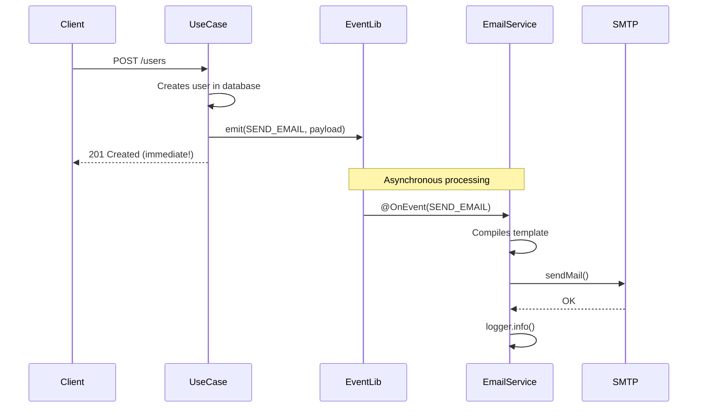

# 📧 Email Service

## Problem

Sending emails in applications requires:
- Managing HTML templates manually with string concatenation
- Configuring SMTP connections everywhere you need to send email
- Duplicating sending logic across multiple use cases
- Coupling business logic to synchronous email sending

```typescript
// ❌ Without centralization
export class UserCreateUsecase {
  async execute(input: UserCreateInput) {
    const user = await this.userRepository.create(entity.toObject())
    
    // 😱 Inline template, manual SMTP, blocking the response
    const transporter = nodemailer.createTransport({
      host: process.env.EMAIL_HOST,
      port: 587,
      auth: { user: process.env.EMAIL_USER, pass: process.env.EMAIL_PASS }
    })
    
    await transporter.sendMail({
      from: 'noreply@app.com',
      to: user.email,
      subject: 'Welcome',
      html: `<html><body><p>Hi ${user.name},</p><p>Welcome!</p></body></html>`
    })
    
    return user // Response waits for email to be sent
  }
}
```

---

## Solution

The **EmailService** centralizes all email sending with:
- **Handlebars Templates** — Reusable `.handlebars` files
- **Event-Driven** — Emails are sent via events (doesn't block the response)
- **Centralized configuration** — SMTP via `SecretsModule`
- **Abstracted interface** — `IEmailAdapter` allows easy mocking in tests

**Flow:** `UseCase` → `EventLib` → `EmailService` → `Handlebars` → `SMTP`

---

## Template System

### 📁 Template Structure

```
src/infra/email/
├── adapter.ts
├── module.ts
├── service.ts
└── templates/
    ├── welcome.handlebars
    ├── reque-reset-password.handlebars
    └── reset-password.handlebars
```

### Template Example (`welcome.handlebars`)

```handlebars
<html>
    <head>
        <style>
            /* CSS customizado */
        </style>
    </head>
    <body>
        <p>Hi {{name}},</p>
        <p>Welcome to your new account</p>
    </body>
</html>
```

### Template com Link (`reque-reset-password.handlebars`)

```handlebars
<html>
    <body>
        <p>Hi {{name}},</p>
        <p>You requested to reset your password.</p>
        <p>Please, click the link below to reset your password</p>
        <a href="{{link}}">Reset Password</a>
    </body>
</html>
```

### 🎯 Handlebars Benefits

| Benefit | Description |
|---------|-------------|
| **Separation** | HTML outside TypeScript code |
| **Reusability** | Same template in multiple places |
| **Variables** | `{{name}}`, `{{link}}` automatically substituted |
| **Maintenance** | Designer can edit HTML without touching code |

---

## How It Works

### 1️⃣ Emit Event (in Use Case)

```typescript
import { SendEmailInput } from '@/infra/email'
import { IEventAdapter } from '@/libs/event'
import { EventNameEnum } from '@/libs/event/types'

export class UserCreateUsecase implements IUsecase {
  constructor(
    private readonly userRepository: IUserRepository,
    private readonly event: IEventAdapter
  ) {}

  async execute(input: UserCreateInput) {
    const user = await this.userRepository.create(entity.toObject())

    // ✅ Fires event and returns immediately
    this.event.emit<SendEmailInput>(EventNameEnum.SEND_EMAIL, {
      email: input.email,
      subject: 'Welcome',
      template: 'welcome',        // Name of .handlebars file
      payload: { name: input.name } // Template variables
    })

    return user // Response doesn't wait for email
  }
}
```

### 2️⃣ EmailService Processes the Event

```typescript
@Injectable()
export class EmailService implements IEmailAdapter {
  constructor(
    private readonly secrets: ISecretsAdapter,
    private readonly logger: ILoggerAdapter,
    private readonly transporter: Transporter<SMTPTransport.SentMessageInfo>
  ) {}

  async send(input: SendEmailInput): Promise<SendEmailOutput> {
    // 1. Reads template from filesystem
    const source = fs.readFileSync(
      path.join(__dirname, `/templates/${input.template}.handlebars`), 
      'utf8'
    )
    
    // 2. Compiles with Handlebars
    const compiledTemplate = handlebars.compile(source)
    
    // 3. Builds options
    const options = () => ({
      from: this.secrets.EMAIL.FROM,
      to: input.email,
      subject: input.subject,
      html: compiledTemplate(input.payload) // Injects variables
    })

    // 4. Sends via nodemailer
    return new Promise((res, rej) => {
      this.transporter.sendMail(options(), (error, info) => {
        if (error) return rej(error)
        return res(info)
      })
    })
  }

  // 👇 This decorator listens to the event automatically
  @OnEvent(EventNameEnum.SEND_EMAIL)
  async handleSendEmailEvent(payload: SendEmailInput) {
    await this.send(payload)
    this.logger.info({ message: 'email sended successfully.' })
  }
}
```

---

## Event-Driven Architecture



### 🎯 Event-Driven Benefits

| Benefit | Description |
|---------|-------------|
| **Fast response** | Client doesn't wait for email to be sent |
| **Decoupling** | Use case doesn't know email details |
| **Resilience** | Email failure doesn't affect response |
| **Testability** | Can test use case without sending emails |

---

## Abstracted Interface

```typescript
// adapter.ts
export abstract class IEmailAdapter {
  abstract send(input: SendEmailInput): Promise<SendEmailOutput>
}

// Types
export type SendEmailInput = {
  subject: string
  email: string
  template: string
  payload: object
}

export type SendEmailOutput = SMTPTransport.SentMessageInfo
```

---

## SMTP Configuration

The module injects the already configured Transporter via factory:

```typescript
// module.ts
@Module({
  imports: [SecretsModule, LoggerModule],
  providers: [
    {
      provide: IEmailAdapter,
      useFactory: (secret: ISecretsAdapter, logger: ILoggerAdapter) => {
        const transporter = nodemailer.createTransport({
          host: secret.EMAIL.HOST,
          port: secret.EMAIL.PORT,
          auth: {
            user: secret.EMAIL.USER,
            pass: secret.EMAIL.PASS
          }
        })
        return new EmailService(secret, logger, transporter)
      },
      inject: [ISecretsAdapter, ILoggerAdapter]
    }
  ],
  exports: [IEmailAdapter]
})
export class EmailModule {}
```

### Required Environment Variables

```env
EMAIL_HOST=smtp.gmail.com
EMAIL_PORT=587
EMAIL_USER=your-email@gmail.com
EMAIL_PASS=your-app-password
EMAIL_FROM=noreply@yourapp.com
```

---

## Where It's Used Today

### 1️⃣ User Creation

```typescript
// src/core/user/use-cases/user-create.ts
this.event.emit<SendEmailInput>(EventNameEnum.SEND_EMAIL, {
  email: input.email,
  subject: 'Welcome',
  template: 'welcome',
  payload: { name: input.name }
})
```
→ Sends **welcome** email to new user

### 2️⃣ Password Reset Request

```typescript
// src/core/reset-password/use-cases/reset-password-send-email.ts
this.event.emit<SendEmailInput>(EventNameEnum.SEND_EMAIL, {
  email: user.email,
  subject: 'Reset password',
  template: 'reque-reset-password',
  payload: { 
    name: user.name, 
    link: `${this.secret.HOST}/api/v1/reset-password/${token}` 
  }
})
```
→ Sends **reset link** with token

### 3️⃣ Password Reset Confirmation

```typescript
// src/core/reset-password/use-cases/reset-password-confirm.ts
this.event.emit<SendEmailInput>(EventNameEnum.SEND_EMAIL, {
  email: user.email,
  subject: 'Password changed',
  template: 'reset-password',
  payload: { name: user.name }
})
```
→ Confirms that **password was changed**

---

## How to Add New Template

### 1️⃣ Create the `.handlebars` file

```handlebars
<!-- src/infra/email/templates/order-confirmation.handlebars -->
<html>
    <body>
        <h1>Order Confirmed! 🎉</h1>
        <p>Hi {{name}},</p>
        <p>Your order #{{orderId}} has been confirmed.</p>
        <p>Total: ${{total}}</p>
        <a href="{{trackingLink}}">Track your order</a>
    </body>
</html>
```

### 2️⃣ Emit event in use case

```typescript
this.event.emit<SendEmailInput>(EventNameEnum.SEND_EMAIL, {
  email: customer.email,
  subject: 'Order Confirmed! 🎉',
  template: 'order-confirmation',
  payload: { 
    name: customer.name,
    orderId: order.id,
    total: order.total.toFixed(2),
    trackingLink: `${this.secret.HOST}/orders/${order.id}/track`
  }
})
```

**Done!** The EmailService handles the rest automatically.

---

## Tests

### Mocking IEmailAdapter

```typescript
const mockEventAdapter = {
  emit: jest.fn()
}

// In test, verify that event was emitted
expect(mockEventAdapter.emit).toHaveBeenCalledWith(
  EventNameEnum.SEND_EMAIL,
  expect.objectContaining({
    email: 'user@test.com',
    template: 'welcome'
  })
)
```

### Mocking EmailService directly

```typescript
const mockEmailService = {
  send: jest.fn().mockResolvedValue({ messageId: 'test-123' })
}
```

---

## Complete Flow

```mermaid
flowchart TB
    subgraph "Core Layer"
        UC1[UserCreateUsecase]
        UC2[ResetPasswordSendEmailUsecase]
        UC3[ResetPasswordConfirmUsecase]
    end
    
    subgraph "Event Layer"
        EV[EventLib]
        EN[EventNameEnum.SEND_EMAIL]
    end
    
    subgraph "Infra Layer"
        ES[EmailService]
        T1[welcome.handlebars]
        T2[reque-reset-password.handlebars]
        T3[reset-password.handlebars]
    end
    
    subgraph "External"
        SMTP[SMTP Server]
    end
    
    UC1 -->|emit| EV
    UC2 -->|emit| EV
    UC3 -->|emit| EV
    
    EV --> EN
    EN -->|@OnEvent| ES
    
    ES --> T1
    ES --> T2
    ES --> T3
    
    ES --> SMTP
```

---

## Related Links

- [Event Library](../libs/event.md) — Event system used to trigger emails
- [Secrets](./secrets.md) — SMTP variables configuration
- [Logger](./logger.md) — Sent emails logging
